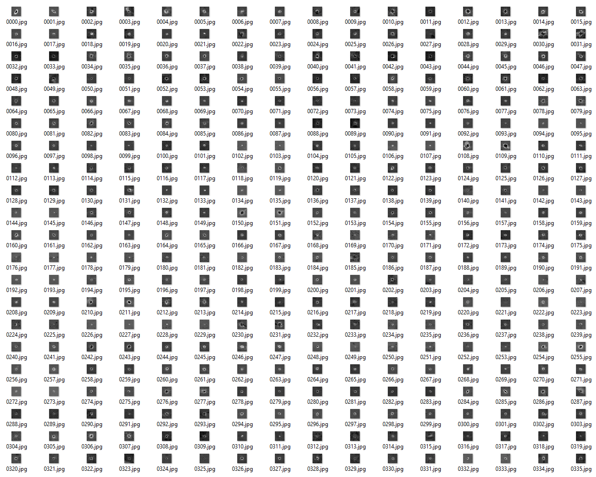

## Detecting Laser Points ##

This project aims to locate the positions of red LASER points in underwater images. It is a work in progress.
So far it uses HAAR cascade, and trains it using the training algorithm available in openCV, opencv_traincascade.exe. 

Here is an example of a successful detection using HAAR cascade. 


The difficult part of achieving good detection is building a good set of training data. That includes both positive images (LASER points) and negative images (general backgrounds without LASER points). 

**Positive samples:**



Notice that these are all grayscale images. That is because the HAAR cascade training algorithm works on a single channel only. Special care therefore has to be taken in order to not loose relevant channel data. Some kind of color normalization, or other transformation to get from RGB to grayscale is very crucial to boost performance. In the present case, since the LASER points are predominantly red, it was found that a function similar to 

```math
  grayscale(R,G,B) = ( R / (R + G) ) x ( R / (R + B) ) 
```

works well. 

Notice how this function is zero if `R = 0` and tends to zero as `G` or `B` tend to infinity. Thus it amplifies pixels that are relatively red in comparison to the other channels, and supresses them otherwise. 
